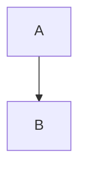
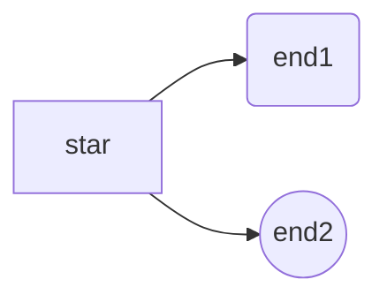

# # <center>MarkDown使用笔记</center>

*** 
<!-- 分割线 -->
[TOC]
<!-- 内容目录 -->
### 1.纯文本
<!-- 三级标题 -->

#### 标题
使用 # 号可表示1~6级<mark>标题</mark>
```markdown
# 一级标题
## 二级标题
### 三级标题
#### 四级标题
##### 五级标题
###### 六级标题
```
```html
<h1>一级标题</h1>
...
<h6>六级标题</h6>
```

#### 更改字体、大小、颜色
```html
<font face="黑体" color=green size=5>我是黑体，绿色，尺寸为5</font>
```

#### 背景颜色
```html
<table><tr><td bgcolor=yellow>背景色yellow</td></tr></table>
```

#### 设置文字居中
```html
<center>居中</center>
<p align="left">左对齐</p>
<p align="right">右对齐</p>
```

### 段落换行
在一行的末尾添加两个或多个`空格`，<br>然后按<ins>回车键</ins>,即可创建一个`换行`，或`<br>`

---
<!-- *** 分割线 -->

### 2. 斜体、粗体和粗斜体
可以使用<mark>斜</mark>、<mark>粗</mark>和<mark>粗斜</mark>体</mark>三种字体，使用 `*` 或 `_` 包裹即可


```markdown
_斜体文本_        // *斜体文本* 
__粗体文本__      // **粗体文本**
___粗斜体文本___  // ***粗斜体文本*** or **_粗斜体文本_** or _**粗斜体文本**_  .etc
```

```markdown
<em>斜体文本</em>                         // <i>斜体文本</i>、<cite>斜体文本</cite>
<strong>粗体文本<strong>                  // <b>粗体文本</b> 
<strong><em>粗斜体文本</em></strong>      // <b><i>c粗体斜体文本</i></b>
```
***
<!-- *** 分割线 -->


### 3.线条
#### 删除线（中线）
<mark>删除线</mark>使用`两个波浪号`~~ 表示
```markdown
~~世界是平坦的~~ 我们现在知道世界是圆的。
```
```html
<s>世界是平坦的</s>我们现在知道世界是圆的。
<del>世界是平坦的</del>我们现在知道世界是圆的。// del语义更加强烈
```
***
<!-- *** 分割线 -->

#### <del>上划线、</del>下划线
markdown中<mark>没有</mark>此语法。但可其他方式实现
```Latex
// 使用Latex
$\underline{\text{下划线}}$
$\overline{\text{上划线}}$
```
```html
<u>下划线</u>      //<ins>下划线</ins> 语义更加强烈
```
---
<!-- --- 分割线 -->
### 4.普通上标、下标
<mark>上</mark>标：X<sup>2</sup>，<mark>下标</mark>：O<sub>2</sub>
```markdown
上标：X^2^，下标：O~2~
```
```html
上标：X<sub>2</sub>，下标：O<sup>2</sup>
```
---
<!-- --- 分割线 -->

### 5.引用
要创建块<mark>引用</mark>，请在段落前添加一个 > 符号
```markdown
> Dorothy followed her through many of the beautiful rooms in her castle.
```
<mark>空白行</mark>
```markdown
> Dorothy followed her through many of the beautiful rooms in her castle.
>
> The Witch bade her clean the pots and kettles and sweep the floor and keep the fire fed with wood.
```

<mark>嵌套</mark>块引用
```markdown
> Dorothy followed her through many of the beautiful rooms in her castle.
>
>> The Witch bade her clean the pots and kettles and sweep the floor and keep the fire fed with wood.
```

带有<mark>其它元素</mark>的块引用
```markdown
> #### The quarterly results look great!
>
> - Revenue was off the chart.
> - Profits were higher than ever.
>
>  *Everything* is going according to **plan**.
```

---
<!-- --- 分割线 -->

### 6.链接
#### Title
给链接增加 <mark>Title</mark>
```markdown
[普通链接带标题](http://localhost/ "普通链接带标题")
```

#### 直链接
使用尖括号 <mark>直链接</mark>
```markdown
<https://markdown.com.cn>
```

#### 锚点链接
<mark>锚点</mark>链接
```markdown
[台词语音鉴赏][audio] 
[audio]: https://pvp.qq.com/ip/voice.html
[海月][audio]
[新英雄][audio]
...
```

#### 强调及反引号使用
<mark>强调</mark> 链接, 增加星号。<ins>链接`=>`代码</ins>，添加反引号
```markdown
I love supporting the **[EFF](https://eff.org)**.
This is the *[Markdown Guide](https://www.markdownguide.org)*.
See the section on [`code`](#code).  //反引号
```

#### 超链接
新页面中打开<mark>a标签</mark>代替
```html
<a href="超链接地址" target="_blank">超链接名</a>
```


***
<!-- *** 分割线 -->


### 8.图片语法

插入图片Markdown语法代码
```markdown


```
对应的<mark>HTML</mark>代码
```html

```
<mark>图片</mark>链接
```markdown
[](https://markdown.com.cn)
```

***
<!-- 分割线 -->
### 9.音频
<mark>audio</mark>标签
```html
<!-- 孤独之塔.mp3 -->
<!-- autoplay 音频在就绪后马上播放 -->
<!-- controls 音频控件 -->
<!-- loop 循环-->
<!-- muted 静音 -->
<!-- preload  1.auto j加载音频 2.metadata 不加载但获取音频长度 3.不加载-->
<audio autoplay controls>
  <source src="https://m10.music.126.net/20221013050157/c7a9973455888342bf218ca6653cf074/ymusic/obj/w5zDlMODwrDDiGjCn8Ky/14055170620/f53e/8be0/9220/2e39c4d19d537ac783ab7f64549cd923.mp3" type="audio/mpeg">
  您的浏览器不支持 audio 元素。
</audio>
```
<mark>iframe</mark>标签
<!-- <iframe frameborder="no" border="0" marginwidth="0" marginheight="0" width=330 height=86 src="https://music.163.com/outchain/player?type=2&id=1850219509&auto=0&height=66"></iframe> -->

<iframe 
frameborder=0
border="0" 
marginwidth="0px" 
marginheight="0px" 
width="100%"
height="86px"
src="http://music.163.com/outchain/player?type=2&id=1850219509&auto=0&height=66"
scrolling="yes">
</iframe>

```html
<!-- 网易云音乐复制 + src:"http:" or "https:" -->
<iframe frameborder="no" border="0" marginwidth="0" marginheight="0" width=330 height=86 src="//music.163.com/outchain/player?type=2&id=1850219509&auto=1&height=66"></iframe>
```

### 10.视频
<mark>video</mark>标签
```html
<!-- mp4格式 -->
<!-- vscode 插件不能显示但浏览器正常 -->
<!-- video> 元素支持三种视频格式：MP4、WebM、Ogg。 -->
<!-- preload 视频在页面加载时进行加载，并预备播放 -->
<video id="video" controls="" preload="none" poster="封面">
      <source id="mp4" src="mp4格式视频" type="video/mp4">
</video>
```
<p align="center">
<video  
width="95%" height="50%" 
controls 
loop
poster="https://w.wallhaven.cc/full/9m/wallhaven-9mjoy1.png">
      <source src="https://api.qiuliqi.top/sp/webm/%E7%81%B5%E9%AD%82%E8%8E%B2%E5%8D%8E%E5%8D%83%E7%8F%8F.webm" 
      type="video/webm" >
</video>
</p>

<mark>iframe</mark>标签
```html
<!-- &danmaku=0 关闭弹幕 -->
<!-- markdown 代码换行不能空行 -->
<!-- width 100 -->
<!-- height 200 -->
<iframe src="//player.bilibili.com/player.html?aid=986613089&bvid=BV1Gt4y1F7iG&cid=860062984&page=1" scrolling="no" border="0" frameborder="no" framespacing="0" allowfullscreen="true"> </iframe>
```

<!-- <p align="center">
<iframe  width="100%" height="200"  src="http://player.bilibili.com/player.html?aid=986613089&bvid=BV1Gt4y1F7iG&cid=860062984&page=1&danmaku=0" scrolling="no" border="0" frameborder="no" framespacing="0" allowfullscreen="true"> </iframe>
</p> -->

***
<!-- 分割线 -->
### 11.转义字符
就是想<mark>输出</mark>什么特殊符号就在前面加 \
```markdown
\\ 反斜杠         \` 反引号         \* 星号     \_ 下划线         \{\} 大括号       \[\] 中括号
\(\) 小括号       \# 井号           \+ 加号     \- 减号           \. 英文句号       \! 感叹号
```
<mark>html</mark>转义字符
```html
空格 &nbsp;     小于号 &lt;         大于号 &gt;       和号 &amp;      引号 &quot;       撇号 &apos;
分 &cent;       镑 &pound;          日圆 &yen;        节 &sent;    © 版权 &copy;     ® 注册商标 &reg;
乘号 &times;    除号 &divide;
```

***
<!-- 分割线 -->
### 12.数学公式
#### 上下标
1.数学公式`居中`写在写在两个`$$`（<ins>文本中的公式使用`一`对单$</ins>  
2.使用代码块`math`  

<mark>上下标</mark>
`^` 表示上标，`_`表示下标。若其多一个字符，则使用 `{}` 括起来

```markdown
 ```math(x^2 + x^y )^{x^y}+ x_1^2= y_- y_2^{x_1-y_1^2}``` //代码块 注意格式换行
```
<!-- 实例 -->
```math
(x^2 + x^y )^{x^y}+ x_1^2= y_1 - y_2^{x_1-y_1^2}
```

#### 分数
```markdown
$$ \frac{1-x}{y+1} $$      // \frac{分子}{分母}
$$ x \over x+y  $$         // 分子 \over 分母
```
<!-- 实例 -->  
$$  
\begin{aligned}  
\frac{1-x}{y+1}   \\  \\  
x \over x+y
\end{aligned}  
$$


#### 开方
```markdown
$\sqrt[3]{4}$     或 $\sqrt{9}$
```
<!-- 实例 -->

$\sqrt[3]{4}$     或    $\sqrt{9}$

#### 括号
`() [] `直接写就行，而` {} `则需要<mark>转义</mark>

```markdown
$  f(x, y) = x^2 + y^2, x \epsilon [0, 100], y \epsilon \{1,2,3\}  $
```
<!-- 实例 -->
$
f(x, y) = x^2 + y^2, x \epsilon [0, 100], y \epsilon \{1,2,3\}
$


##### 大括号
需要括号<mark>前</mark>加`\left`和`\right`
$\left(\sqrt{1 \over 2}\right)^2$

`\left` 和 `\right`必须<mark>成对</mark>。不显示的一边使用` . `代替  
```markdown
$$ \left. \frac{du}{dx} \right | _{x=0} $$
```
$$ \left. \frac{du}{dx} \right | _{x=0} $$

##### 花括号
`\\`数学公式<mark>内换行</mark>
```markdown  
$$  
\begin{aligned}  
公式1   \\  
公式2
\end{aligned}  
$$
```  
$$  
\begin{aligned}  
5+3=8   \\  
4+2=6
\end{aligned}  
$$  

<!-- 实例 -->
`花括号`
```markdown
$$ y :\begin{cases} x+y=1\\ x-y = 0 \end{cases} $$
```
$$ 
y :\begin{cases} x+y=1  \\   
x-y = 0 \end{cases} 
$$

* * *
<!-- 分割线 -->
### 13.table（表格）
`三个`或多个连字符`---`创建每列title
<mark>管道</mark>`|`分隔每列
<mark>冒号对齐</mark>`:`测左、侧右侧或中心

```markdown
| Syntax      | Description | Test Text     |
| :---        |    :----:   |          ---: |
| Header      | Title       | Here's this   |
| Paragraph   | Text        | And more      |
```
<!-- markdown 无合并单元格 -->
| Syntax      | Description | Test Text     |
| :---        |    :----:   |          ---: |
| Header      | Title       | Here's this   |
| Paragraph   | Text        | And more      |


```html
<table contenteditable="true" style="text-align:center">
    <tr>
        <th rowspan="2">真实情况</th>
        <th colspan="2">预测结果</th>
    </tr>
    <tr>
        <td>正例</td>
        <td>反例</td>
    </tr>
    <tr>
        <td>正例</td>
        <td>TP(真正例)</td>
        <td>FN(假反例)</td>
    </tr>
    <tr>
        <td>反例</td>
        <td>FP(假正例)</td>
        <td>TN(真反例)</td>
    </tr>
</table>

<!-- 
合并单元格
跨行：rowspan
跨列：colspan
style :行内样式
H5中仅支持"border"属性，值 为"" 或 "1" 
-->
```
<!-- 实例 -->
<table style="text-align:center">
    <tr>
        <th rowspan="2">真实情况</th>
        <th colspan="2">预测结果</th>
    </tr>
    <tr>
        <td>正例</td>
        <td>反例</td>
    </tr>
    <tr>
        <td>正例</td>
        <td>TP(真正例)</td>
        <td>FN(假反例)</td>
    </tr>
    <tr>
        <td>反例</td>
        <td>FP(假正例)</td>
        <td>TN(真反例)</td>
    </tr>
</table>

* * *
<!-- 分割线 -->

### 14.列表
#### 有序列表
```markdown
1. First item
2. Second item
3. Third item
4. Fourth item
```

```html
<ol>
<li>First item</li>
<li>Second item</li>
<li>Third item</li>
<li>Fourth item</li>
</ol>
```

#### 无序列表
加破折号 `-`、星号 `*` 或加号 `+`
```markdown
- First item
- Second item
- Third item
- Fourth item
```

```html
<ul>
<li>First item</li>
<li>Second item</li>
<li>Third item</li>
<li>Fourth item</li>
</ul>
```

#### 嵌套列表
`缩进一个`或多个列表项
```markdown
1. First item
2. Second item
3. Third item
    - Indented item
    - Indented item
4. Fourth item
```

<!-- 实例 -->
1. First item
2. Second item
3. Third item
    - Indented item
    - Indented item
4. Fourth item

### 15.目录
#### TOC
全称为 Table of Content，<mark>自动列出</mark>全部标题
```markdown
[TOC]
```
#### 手写目录
```markdown
[目录名](#标题链接)
```
### 16.流程图
T-`上`，B\D-`下`，L-`左`，R-`右`  
graph LR `横向`，graph TD `纵向`

上到下
```markdown
~~~mermaid
graph TD
A --> B
~~~
```
<!-- 演示 -->


```markdown
<!-- 线条形状 -->
[   ]直角矩形       (   )圆角矩形
{   }菱形           >  ]不对称矩形
(( ))圆形

<!-- 线条连接 -->
<!-- 实战建议  ~~~~   替换 ```    -->
<!-- id 后不能空格 -->

​~~~mermaid
graph LR
    A10[A10] --- A11[A11]       // 实线
    A20[A20] === A21[A21]       // 加粗实线
    A30[A30] -.- A31[A31]       // 虚线
    B10[B10] --> B11[B11]       // 带箭头实线
    B20[B20] ==> B21[B21]       // 带箭头加粗实线
    B30[B30] -.-> B31[B31]      // 带箭头虚线
    C10[C10] --yes--> C11[C11]  // 备注
    C20[C20] ==yes==> C21[C21]  // 加粗实线备注
    C30[C30] -.yes.-> C31[C31]  // 虚线备注
​~~~
```

```markdown
<!-- 同节点star  指明id -->
​~~~mermaid
graph LR
	A[开始节点] --> B[结束节点1]
	A --> C[结束节点2]
​~~~

<!-- 子流程图 -->
subgraph title
  graph direction
end
```




